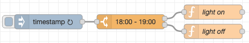

# Time of day node for Node-RED

<p align="center">
    
</p>

A simple node that forwards an input message if the current time is within given range.<br>
The message is also forwarded through a second output on falsy results.

## Installation
Either use the Node-RED palette manager or install it manually, like so:

```shell
cd ~/.node-red
npm install node-red-contrib-time-of-day
```

## Usage
Set a start and end time in the node. If the current time matches the range
the input will be forwarded to output 1 otherwise to the optional output 2.
